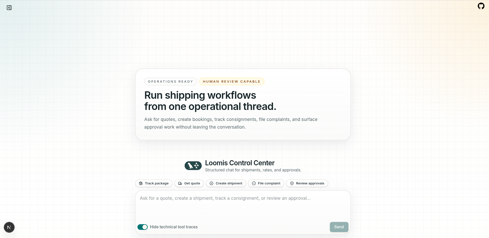
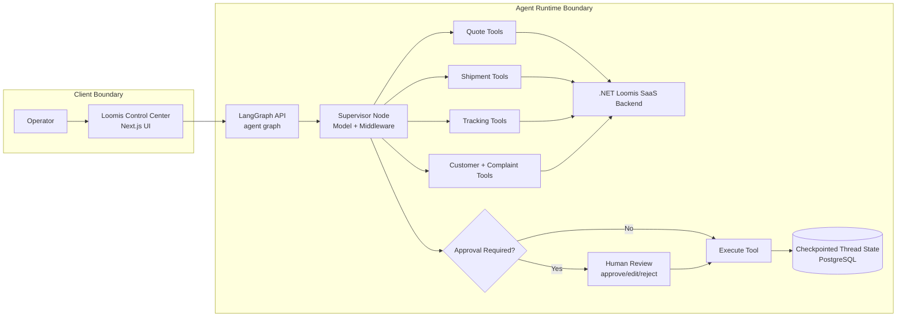

# 🚚 Agentic shipping system that automates quote → booking → tracking workflows

> AI Logistics Orchestrator is a multi-tool agent system for courier operations with checkpointed resumes, one-click operator UX, and policy-based approvals on sensitive actions.

> Tool execution is backed by the Loomis .NET backend: [loomis-saas](https://github.com/Thiwanka-Sandakalum/loomis-saas).

**[Live Demo (add URL)](https://your-demo-url) · [Loom Walkthrough (add URL)](https://loom.com/...) · [Architecture Notes](docs/project-structure.md) · [Project Plan](plan.md)**


## Demo Preview (Until Video Is Published)



---

## The Problem
Courier teams handle quoting, booking, tracking, customer verification, and complaints in separate systems.
That fragmentation causes slower response time, repeated manual input, and risky approval paths for actions that should never run without human sign-off.

## The Solution
This project consolidates the full operator workflow into one agentic interface:

- quote selection
- shipment booking
- shipment tracking
- customer snapshot retrieval
- complaint filing

It pauses only where policy demands review (`create_shipment`, `file_complaint`), then resumes from persisted thread state without losing context.

All tool-side business operations are delegated to the Loomis SaaS backend implemented in .NET:
[https://github.com/Thiwanka-Sandakalum/loomis-saas](https://github.com/Thiwanka-Sandakalum/loomis-saas)

---

## System Architecture

### Named patterns implemented

- **Supervisor pattern**: central model+middleware node routes and governs tool execution
- **HITL interrupt/resume pattern**: explicit approve/edit/reject decisions before protected tools execute
- **Checkpointer persistence pattern**: thread state survives pauses and resumptions
- **Guardrail middleware pattern**: retries, call limits, and summarization to bound failure loops
- **External backend integration pattern**: agent tools call the .NET Loomis SaaS backend for business data and transactional operations

### Boundary diagram



---

## Metrics And Evaluation

These numbers should come from reproducible local runs over at least 20 to 30 inputs.

| Metric | Current Status |
|---|---|
| p50 latency / run | Not yet benchmarked |
| LLM cost / run | Not yet measured |
| HITL trigger rate | Not yet measured |
| Automated test coverage | Not yet reported |

### Measurement plan

1. Run 20 to 30 seeded scenarios across quote, booking, tracking, complaint paths.
2. Capture latency per run and per major step from LangSmith traces.
3. Export token and model usage to estimate cost per run.
4. Compute HITL trigger percentage for protected tools.
5. Add a permanent `benchmarks/` note with date-stamped results.

---

## Quick Start

### Option A: Local dev (3 commands)

```bash
git clone https://github.com/Thiwanka-Sandakalum/AI-logistics-orchestrator && cd AI-logistics-orchestrator
cp .env.example .env
langgraph dev
```

### Option B: Docker Compose

```bash
git clone https://github.com/Thiwanka-Sandakalum/AI-logistics-orchestrator && cd AI-logistics-orchestrator
cp .env.example .env
docker compose up --build
```

### Optional web UI (separate terminal)

```bash
cd chat-ui && npm install && npm run dev
```

### Running service URLs

- LangGraph API: `http://localhost:2024`
- LangGraph Studio: opened by `langgraph dev` (terminal prints the URL)
- Web UI: `http://localhost:3000`

### Environment keys

All required keys are listed and commented in `.env.example`.

- Paid API key: `GOOGLE_API_KEY`
- Runtime model and behavior: `MODEL_ID`, `MODEL_TEMPERATURE`, `MODEL_MAX_TOKENS`
- External .NET backend: `EXISTING_API_BASE_URL`, `EXISTING_API_TIMEOUT`, `EXISTING_API_MAX_RETRIES`
- Persistence: `POSTGRES_URI`
- Tracing: `LANGSMITH_API_KEY`, `LANGSMITH_PROJECT`, `LANGSMITH_ENDPOINT`

### Backend dependency

Domain tool calls in this agent rely on the Loomis SaaS backend:

- Repo: [loomis-saas](https://github.com/Thiwanka-Sandakalum/loomis-saas)
- Integration boundary: `src/tools/*` -> external API via configured base URL

### Docker note

`docker-compose.yml` is included in this repository.
Use `docker compose up --build` for containerized startup, or use `langgraph dev` + optional Next.js UI for direct local development.

---

## Engineering Decisions (Tradeoffs)

### 1) HITL enforcement in middleware vs UI-only confirm

- **Chosen**: middleware-level HITL with interrupt policies
- **Alternative**: client-only confirm buttons
- **Why**: middleware guarantees policy compliance even if clients change; UI-only checks are bypassable

### 2) Modular domain tool packages vs single tool file

- **Chosen**: isolated modules under `src/tools/` by domain
- **Alternative**: monolithic tool implementation
- **Why**: clearer ownership, easier testing, lower regression risk when changing one workflow

### 3) Checkpointed thread persistence vs stateless request handling

- **Chosen**: persisted thread state for pause/resume
- **Alternative**: stateless API that replays context from client each turn
- **Why**: HITL and long workflows need durable continuity and safer resumption semantics

---

## Repository Structure

```text
.
├── langgraph.json                # Graph registration (agent -> src/graph.py)
├── src/
│   ├── graph.py                  # thin graph entrypoint
│   ├── agent/                    # model, prompt, middleware, tool registry
│   ├── tools/                    # domain tools: quote, shipment, tracking, customer, complaint
│   ├── storage/                  # storage gateways/utilities
│   └── config/                   # runtime settings
├── chat-ui/                      # Next.js/Turbo operator interface
├── docs/                         # docs and architecture notes
└── tests/                        # unit/integration tests
```

---

## Skills Demonstrated

`LangGraph` `Supervisor pattern` `Human-in-the-loop` `Checkpoint persistence`
`LangChain middleware` `Tool orchestration` `Operator UX` `Reliability guardrails`
