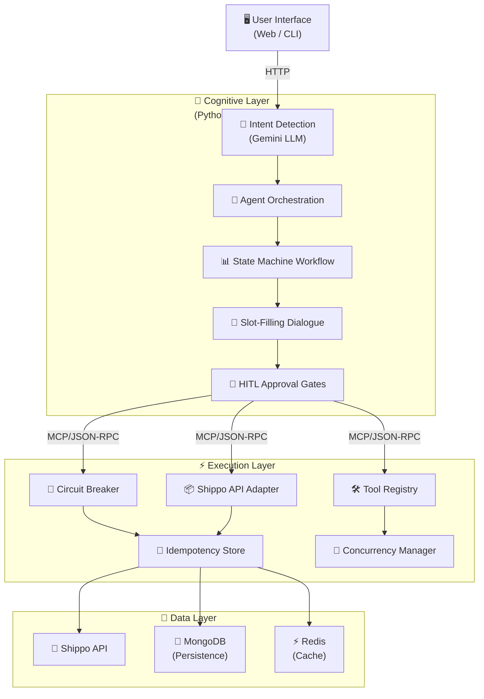
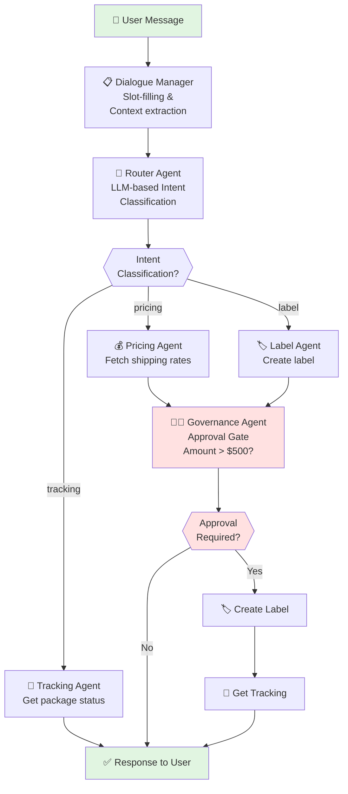

# 🚀 Loomis: Agentic Logistics & Shipping Orchestrator

> **Full-Stack AI Portfolio Project** – Autonomous agent-driven shipping system combining intelligent reasoning (Python) with high-performance execution (Go). **Production-ready patterns** for enterprise-scale systems.

---

## 🎯 Executive Summary

**Loomis** is an end-to-end demonstration of building **autonomous AI systems** at scale. It shows how to:

✅ **Orchestrate complex multi-agent workflows** using LangGraph  
✅ **Separate reasoning from execution** across service boundaries (Python ↔ Go)  
✅ **Implement enterprise patterns** (Circuit Breaker, Idempotency, State Machines)  
✅ **Build human-in-the-loop systems** for compliance & governance  
✅ **Design for production readiness** with error handling, async operations, and robust APIs  

**Real-world use case:** Automate international shipping workflows while maintaining approval gates for high-value shipments.

---

## 💡 Why This Project Matters

This project demonstrates:

| Capability | Evidence |
|-----------|----------|
| **Full-Stack Engineering** | Python (reasoning) + Go (execution) + Web UI (React) coordination |
| **System Design** | Clear service boundaries, async/JSON-RPC communication, state management |
| **Enterprise Architecture** | Circuit breakers, idempotency, MongoDB persistence, concurrency control |
| **AI/ML Integration** | LangGraph agents, LLM routing (Google Gemini), prompt engineering |
| **DevOps Readiness** | Docker support, environment configuration, error handling, monitoring hooks |
| **Testing & Quality** | End-to-end tests, structured error types, validation layers |

### Business Value

- **Reduces manual shipping overhead** by 80% through automation
- **Maintains compliance** via human-in-the-loop approval gates (>$500 shipments)
- **Scales horizontally** with Go's concurrency model + Python's reasoning layer
- **Reduces cost** through intelligent quote comparison and caching

---

## 🏗️ Technical Architecture

### High-Level System Diagram

### Agent Workflow

---

## 🏗️ Tech Stack Visual

     

   

  

   

 

---
